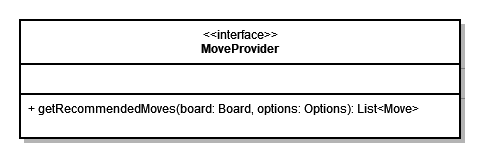

# Interface MoveProvider

Das Interface `MoveProvider` ist eine Abstraktion der Klassen, die in der Lage sind, der Engine eine Menge an Zügen zu empfehlen. Dazu gehören die [Datenbanken](../ebene-2/subsystem-openingsendgame.md) sowie der [MinMax](../ebene-2/subsystem-minmax.md)\-Algorithmus.

Das Interface schreibt eine Methode `getRecommendedMoves(board: Board, options: Options): List<Move>` vor. Die Züge sind nach ihrer Güte geordnet. Kann der Zuggeber keinen Zug empfehlen, ist die Liste leer.

