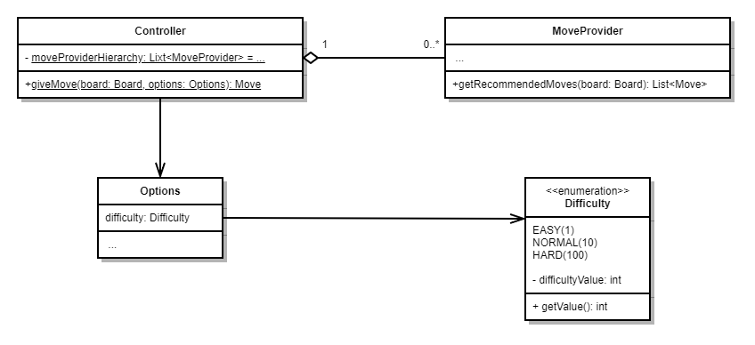

# Subsystem Controller

Der statische `Controller` orchestriert die Anfragen der Zuggeber und selektiert den auszuführenden Zug. Er verfügt über eine öffentliche statische Methode `giveMove(...): Move`, über die er angesprochen werden kann. Intern verfügt er über eine Liste von `MoveProvider`s, die die Hierarchie der Zuggeber (d.h. die Reihenfolge, in der die Zuggeber zu Rate gezogen werden) bestimmt.

Die statische Methode `giveMove(board: Board, options: Options): Move` nutzt die Zuggeber, um den für das aktuelle Board besten (bzw. passendsten) `Move` zu ermitteln.

Der Schwierigkeitsgrad der Engine lässt sich über die Option `difficulty` einstellen (Dazu siehe auch [Options](../../../flengine/querschnittliche-konzeption/optionen.md)). Der Konkrete Umgang mit der Schwierigkeit ist in [Zugermittlung Controller](../../../flengine/laufzeitsicht/zugermittlung/zugermittlung-controller.md) nachzulesen.