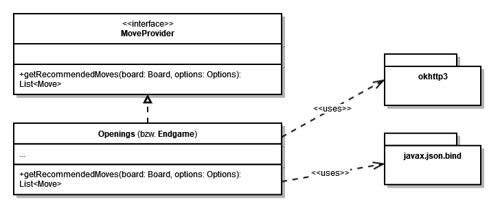

# Subsystem Openings/Endgame

Beide Subsysteme implementieren das Interface [MoveProvider](../ebene-2/interface-moveprovider.md). Zur Ermittlung guter Züge fragen sie ihre entsprechende Datenbank an und wandeln die erhaltenen Daten in ein `Move`\-Objekt um.

Beide Subsysteme nutzen `okhttp3` und `javax.json.bind`, um mit der API von Lichess zu interagieren.

Diese Zusammenhänge sind auch im untenstehenden Diagramm abgebildet.

