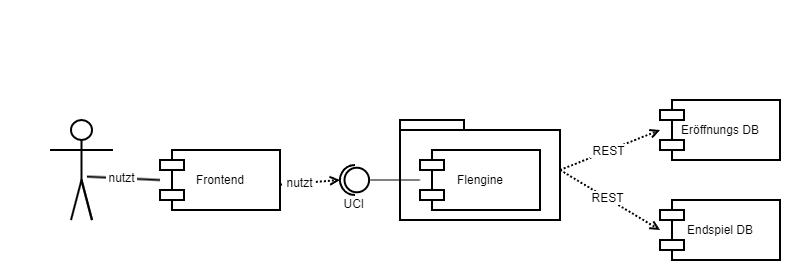

# Kontextabgrenzung

Hier wird das Umfeld von Flengine beschrieben, d.h. in mit welchen externen Systemen sie interagiert und wie Nutzer auf sie zugreifen können.

Folgendes Diagramm zeigt einerseits die Nutzungsweise der Engine, beispielsweise durch ein Frontend - andererseits auch die Abhängigkeiten von Fremdsystemen.

# Zugriff über UCI

Der Zugriff (die Nutzung) der Engine erfolgt über das Universall Chess Interface (UCI)-Protokoll. Flengine stellt diese Schnittstelle bereit.

# Frontend (Fremdsystem)

Aufgrund der Nutzung von UCI ist es möglich, ein beliebiges UCI-kompatibles Frontend an die Engine angebunden, über das ein menschlicher Nutzer mit Flengine interagieren kann.

# Eröffnungs DB (Fremdsystem)

Zur Eröffnung von Schachpartien existieren Datenbanken, die alle möglichen Züge und die besten Reaktionen darauf enthalten. Flengine bedient sich einer solchen Datenbank, um in diesem Spielabschnitt die besten Züge zu machen.

Der Zugriff auf diese Datenbank geschieht via einer REST-Schnittstelle über HTTP.

# Endspiel DB (Fremdsystem)

Auch für das Endspiel existiert nur eine geringe Anzahl an möglichen Ausgängen. Auch hier bedient sich Flengine einer Datenbank, die solche Züge und Reaktionszüge beinhaltet.

Der Zugriff auf diese Datenbank geschieht via einer REST-Schnittstelle über HTTP.