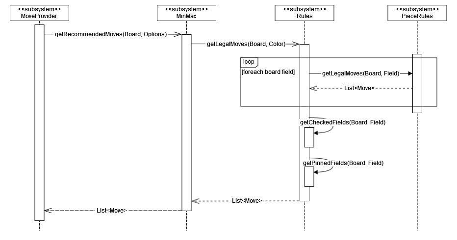

# Rules

Im folgenden Sequenz-Diagramm ist die Kommunikation zwischen dem MoveProvider sowie den Rules und PieceRules veranschaulicht.

Wenn die MoveProvider für die Opening- und Endgame-Datenbanken keine Spielzüge zurückliefern, so wird für die Berechnung des nächsten Zugs auf das Schach-RuleSet zurückgegriffen. Um mithilfe des MinMax den nächsten, bestmöglichen Zug berechnen zu können, muss zuerst eine Liste aller möglichen Spielzüge einer Farbe übergeben werden, die vom MinMax anschließend bewertet werden können.

Werden vom MinMax die legalen Züge eines bestimmten Schachbretts angefragt, so werden zuerst die möglichen Züge für jedes Feld je nach Figur berechnet. Dafür nutzen die `Rules` die seperate Klasse `PieceRules`, die die möglichen Züge für eine Figur eines bestimmten Feldes zurückgibt. Die `PieceRules` beinhaltet für jede Schachfigur eine eigene Methode, die die individuellen Zugmuster einer Figur berücksichtigt sowie spezielle Zugregeln beinhaltet (Rochade, En Passant).

Im Anschluss wird die Liste der möglichen Spielzüge gesammelt und anhand der Stellung der Figuren aussortiert. Dazu zählen Schachregeln wie das Ziehen im Schach oder das Bewegen einer “gefesselten” Figur, welche die Zugmöglichkeiten einer Figur einschränken. Die übrigen Liste wird zum Schluss an den MinMax übergeben, der aus der Auswahl aller möglichen Schachzüge den Besten errechnen kann.