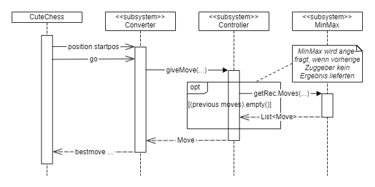

# Zugermittlung

Auf oberster Ebene kommt die Anfrage zur Zugermittlung beim Subsystem Converter an. Dieser konsultiert den Controller der Engine, um einen Move zu erhalten, den er dann an das Frontend Cute Chess zurückgibt.

Die mittels “position“ übergebene Stellung wird vom Converter in entsprechende Objekte konvertiert. Auf dieser Basis startet der Controller die Berechnung mittels der MinMax-Algorithmusumsetzung und erhält den nächsten Zug. Dieser wird vom Konverter in das für die GUI lesbare Format konvertiert und zurückgegeben.

Der detaillierte Ablauf innerhalb der beteiligten Komponenten ist in den Unterseiten dokumentiert:

*   [Zugermittlung Converter](./zugermittlung/zugermittlung-converter.md)
*   [Zugermittlung Controller](./zugermittlung/zugermittlung-controller.md)
*   [Zuermittlung MinMax](./zugermittlung/zuermittlung-minmax.md)