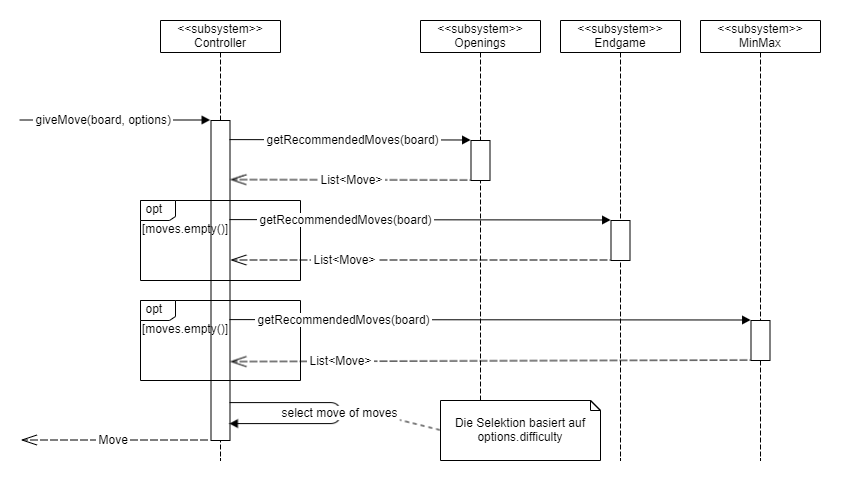

# Zugermittlung Controller

Wie in der [Bausteinsicht des Controllers](../../../flengine/bausteinsicht/ebene-2/subsystem-controller.md) aufgezeigt, verfügt er über eine Liste an `MoveProvider`s, die er zur Zugfindung konsultiert. Diese werden in der unten beschriebenen Reihenfolge angefragt, wenn der jeweils vorhergegangene Zuggeber keine Züge geliefert hat.

Am Ende wird einer der Züge ausgewählt und zurückgegeben. Die Auswahl des Zuges basiert auf dem Wert der angegebenen Werten von `Options.difficulty` (dazu siehe auch [Optionen](../../../flengine/querschnittliche-konzeption/optionen.md) und [Subsystem Controller](../../../flengine/bausteinsicht/ebene-2/subsystem-controller.md) ). Jeder der Schwierigkeitsgrade steht intern für eine Zahl. Je höher die angegebene Zahl, desto besser die Züge der Engine - je kleiner die Zahl, desto schlechter. Dies ist so realisiert, dass größere Werte des Schwierigkeitsgrads dazu führen, dass Züge weiter "vorne" in der Liste der von den Zuggebern empfohlenen Zügen gewählt werden.

Die Zuggeber `Openings` und `Endgame` beantworten die Anfragen an sie mittels der Datenbanken. Die ausführliche Zugermittlung in Minmax ist in [Zuermittlung MinMax](../zugermittlung/zuermittlung-minmax.md) dokumentiert.