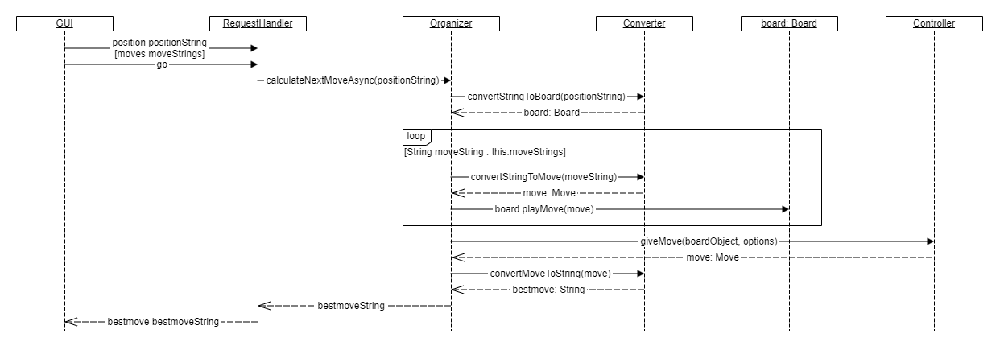

# Zugermittlung Converter

Innerhalb des [Subsystems Converter](../../../docs/bausteinsicht/ebene-2/subsystem-converter.md) startet eine vom GUI angefragte Zugermittlung. Der Ablauf ist folgendermaßen:

Die GUI sendet mit “position“ die Ausgangsposition und optional mit seitdem gespielten Zügen (dazu siehe [UCI-Ablauf](../../laufzeitsicht/uci-ablauf.md)). Auf das Kommando “go” startet der `RequestHandler` einen neuen `Organizer` mit den angegebenen Daten.

Der `Organizer` nutzt den Converter, um aus den gegebenen Daten zunächst das Ausgangs-Board zu erstellen. Jeden seit der Ausgangssituation gespielten Zug wandelt er mittels des Converters in ein `Move`\-Objekt um, welches er dann auf dem eben erhaltenen `Board` mittels `Board.playMove(move: Move)` “nachspielt”.

Das nun aktuelle `Board` und die vom `RequestHandler` erhaltenen (d.h. vom GUI zuvor festgelegten) `Options` übergibt der `Organizer` an den `Controller`, damit dieser daraus den aktuell passendsten `Move` ermittelt.

Wie die Zugermittlung im Controller abläuft, ist in [Zugermittlung Controller](../zugermittlung/zugermittlung-controller.md) beschrieben.

Erhält der `Organizer` den angefragten besten `Move` vom `Controller`, wandelt er ihn unter Benutzung des `Converters` wieder in einen für die GUI lesbaren `String` um und gibt ihn an den `RequestHandler` zurück.

Der `RequestHandler` beantwortet zuguterletzt die Zug-Anfrage des GUI mit dem ermittelten Zug.

