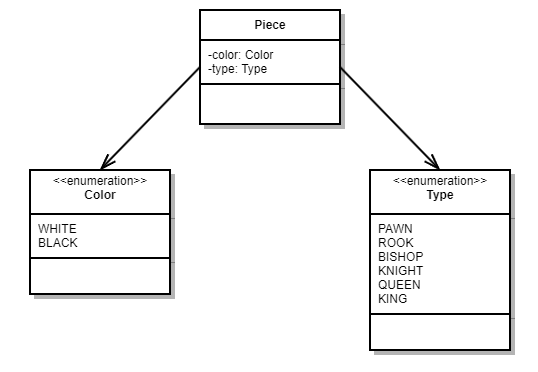

# Domänenmodell

Grundlage des Schachspiels ist das Schachbrett. Innerhalb der Flengine wird das Schachbrett “hin- und hergereicht”. Das Brett beinhaltet die aktuellen Figuren an ihren entsprechenden Positionen und die Information, welche Farbe als nächstes am Zug ist (d.h. für welche Farbe die Engine den besten Zug generieren soll).

Im Folgenden sind beginnend bei der Spielfigur (`Piece`) alle Datentypen des Domänenmodells aufgeführt:

*   [Piece](#piece)
*   [Move und Field](#move-und-field)
*   [Board](#board)

# `Piece`

Schachfiguren werden durch den Datentyp `Piece` abgebildet. Er beinhaltet die Farbe (`Color`) der Figur sowie den Typ (`Type`).

# `Move` und `Field`

Spielzüge werden mittels `Move` abgebildet, welche aus Start- und Zielfeld bestehen. Felder (`Field`s) werden durch die Koordinaten A-H und 1-8 dargestellt, welche in den Enumerationen `Row` und `Line` angegeben sind.

# `Board`

Diese Klasse ist ein Container für den momentanen Stand des Spiels. Es enthält ein 2D-Array, das die Spielfiguren (`Piece`s) enthält und die Farbe (`Color`), die den nächsten Zug machen darf. Ist ein Feld des Schachbretts unbesetzt, steht an dieser Stelle `null` im Array.

An den Methoden sieht man, dass der Zugriff auf das interne Array `pieces` “wegabstrahiert” ist, und nur mit den Datentypen `Field` und `Move` gearbeitet wird.

Außerdem bietet das Schachbrett die Möglichkeit, Transformationen auf sich anzuwenden: `playMove(move: Move)` führt einen Zug auf dem Schachbrett aus. Dabei verändert sich das ursprüngliche Schachbrett.

