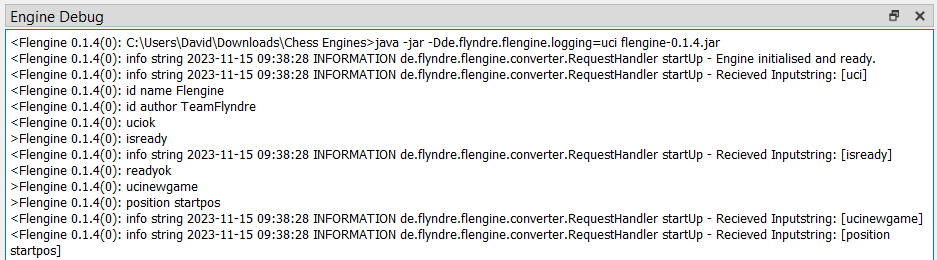
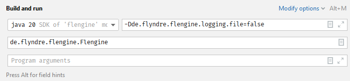
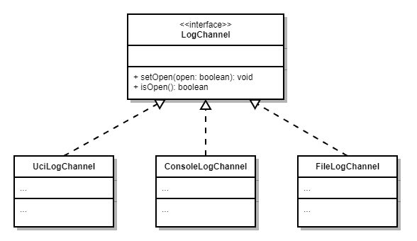
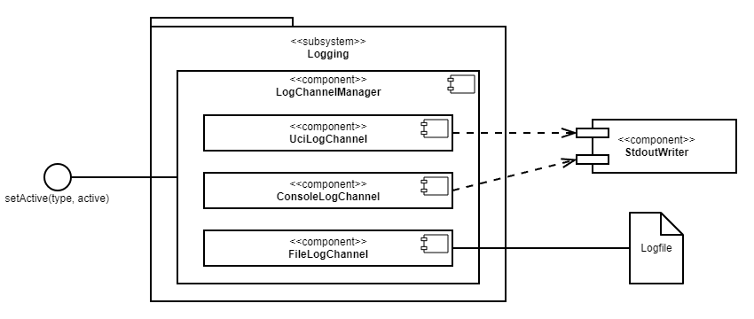

# Logging

Für die Fehlersuche und Verbesserung der Engine ist Logging nützlich - insbesondere weil während der Nutzung mit einem GUI nicht in einer IDE gedebuggt werden kann.

Dazu nutzt Flengine das in Java native Logging `java.util.logging`. Jede Klasse, die Logging nutzen will, fordert einen `Logger` über `Logger.getLogger(<Pfad der momentanen Klasse>)`an.

Innerhalb des Cute Chess-GUI sieht das UCI-Logging so aus:



Das Logging von Flengine behilft sich einiger Konzepte, welche im Folgenden erläutert werden:

*   [Logging-Konfiguration](#logging-konfiguration)
    *   [UCI](#uci)
    *   [BAT-Datei bzw. Kommandozeile](#bat-datei-bzw-kommandozeile)
    *   [IDE (IntelliJ IDEA)](#ide-intellij-idea)
*   [Implementierung](#implementierung)
    *   [Channels](#channels)
    *   [Channel-Manager](#channel-manager)
    *   [Übersicht](#bersicht)

# Logging-Konfiguration

Beim Starten der Flengine kann über das JVM-Argument `de.flyndre.flengine.logging.<logging-typ>=true` festgelegt werden, ob und wie geloggt werden soll. Die Engine reagiert auf folgende Werte folgendermaßen:

| **Logging-Typ** | **Bedeutung** |
| --- | --- |
| `console` | Loggt in die Konsole (standardmäßig in `System.err`) |
| `file` | Loggt in eine für jede Instanz eigen angelegte Logdatei, die im Ausführungsverzeichnis abgelegt ist |
| `uci` | Loggt UCI-kompatibel, d.h. in `System.out` und gepräfixt mit `"info string"` |
| (keiner) | Kein Logging |

## UCI

UCI spezifiziert ein Kommando `debug` mit den Werten `on` und `off`, um Debug-Nachrichten der Engine an- bzw. auszuschalten. Zusätzlich zu den folgenden Methoden, kann so das UCI-Logging separat gesteuert werden. Um UCI-Logging anzuschalten, muss das GUI folgendes Kommando senden:

```
debug on
```

## BAT-Datei bzw. Kommandozeile

Wird Flengine mit der BAT-Datei gestartet, muss ihr Inhalt um das Argument `-Dde.flyndre.flengine.logging.<logging-typ>=true` ergänzt werden. Der Inhalt der BAT (bzw. das Kommando zum Starten) lautet dann beispielsweise folgendermaßen:

```
java -jar -Dde.flyndre.flengine.logging.console=true flengine-1.0.0.jar
```

## IDE (IntelliJ IDEA)

IntelliJ bietet die Möglichkeit unter `Run > Edit Configurations...` die Optionen für die Ausführung eines Projektes zu bearbeiten. Innerhalb einer Run Configuration kann dann wie im Bild unten rechts oben sichtbar, `Modify options` ausgewählt, und die Option `Java > Add VM options` aktiviert werden. Dann wird das in der Abbildung fokussierte Feld angezeigt und der Options-String kann eingefügt werden.

Im Repository befindet sich in `.idea/runConfigurations` eine gespeicherte Run Configuration, die IntelliJ normalerweise automatisch erkennen sollte.



# Implementierung

Die Implementierung des Loggings befindet sich im Package `de.flyndre.flengine.logging`. Beim Logging der Flengine sind Channels ein zentrales Konzept:

## Channels

Da das Logging dynamisch an- und ausgeschaltet werden können soll, ist die Abstraktion in Channels sinnvoll. Jede Logging-Art (UCI, Datei, Konsole) hat dabei einen eigenen Log-Channel. Wird ein Log an den Logger “gesendet”, “verteilt” dieser den Log an alle momentan offenen Log-Channel. Anders formuliert sind Log-Channels Kanäle, über die der Logger die Logs veröffentlicht.

Dabei kann jeder Channel gesondert geöffnet und geschlossen werden. Das Interface `LogChannel` definiert diese Funktionalität. Für jede Logging-Art existiert eine implementierung dieses Interfaces:



## Channel-Manager

Der `LogChannelManager` ist eine zentrale Instanz, um die `LogChannel`s zu verwalten. So kann zu einem beliebigen Zeitpunkt eine beliebige Komponente der Engine einen Kanal öffnen bzw. schließen, indem sie `LogChannelManager.setOpen(type: LogChannelType, open: boolean)` aufruft.

## Übersicht

Folgendes Diagramm stellt die Beziehungen der Komponenten des Pakets `de.flyndre.flengine.logging` dar - sowie deren Abhängigkeiten und Schnittstellen nach außen.

