# Deployment

Wie in folgender Abbildung dargestellt, wird Flengine als JAR-Datei ausgeliefert. Diese lässt sich patformunabhängig innerhalb des Java Runtime Environment ausführen. Zum einfacheren Betrieb unter Windows wird parallel zur JAR eine BAT-Datei bereitgestellt, die innerhalb der GUI zum Starten der Engine ausgewählt werden kann.

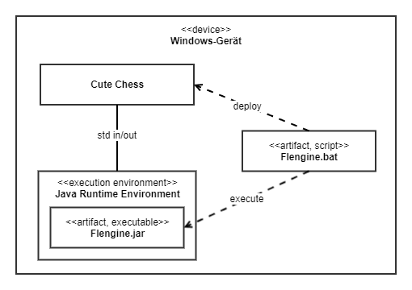

Wie genau die Installation und Verwendung funktioniert wird in den folgenden Abschnitten erklärt:

*   [Voraussetzungen](#voraussetzungen)
*   [Installation](#installation)
*   [Konfiguration](#konfiguration)
*   [Verwendung](#verwendung)

# Voraussetzungen

Um die Flengine nutzen zu können muss mindestens die JRE 21 installiert sein. Heruntergeladen werden kann beispielsweiße die JDK von Temurin: [https://github.com/adoptium/temurin21-binaries/releases/tag/jdk-21.0.1+12](https://github.com/adoptium/temurin21-binaries/releases/tag/jdk-21.0.1%2B12)

# Installation

1.  **Installation von Cutechess**
    

Cutechess kann auf Github heruntergeladen werden. Cutechess ist das verwendete Frontend und wird von den Entwicklern empfohlen. Unter folgendem Link kann der Release 1.3.1 heruntergeladen werden:

[https://github.com/cutechess/cutechess/releases/tag/v1.3.1](https://github.com/cutechess/cutechess/releases/tag/v1.3.1)

2.  **Herunterladen der Flengine**
    

Die Flengine kann ebenfalls über den Github Release heruntergeladen werden. Wir empfehlen dabei den neusten Release zu verwenden um mögliche Bugs, Fehlern oder falschen Spielzügen vorzubeugen.

[https://github.com/L4kiLuk/Flengine](https://github.com/L4kiLuk/Flengine)

3.  **Entpacken der Flengine**
    

Die heruntergeladene Zip-Datei muss jetzt entpackt werden. Alle Inhalte des Ordners müssen im selben Ordner liegen. Im Ordner müssen sich nach dem Entpacken also eine JAR-Datei sowie aus ein BAT-Skript befinden.

4.  **Hinzufügen der Engine in Cutechess**
    

Dieser Schritt ist von Schach-UI zu Schach-UI anders. Da anhand von Cutechess getestet wird, wird dieser Vorgang daher hier erklärt. Wenn ein anderes UI verwendet wird muss sichergestellt werden, das es das UCI-Protokoll unterstützt und dieses auch ausgewählt ist.

Um die Engine in Cutechess hinzuzufügen, müssen zuerst die Einstellungen geöffnet werden. Diese können im Tools-Tab gefunden werden, wie im folgenden Screenshot abgebildet.

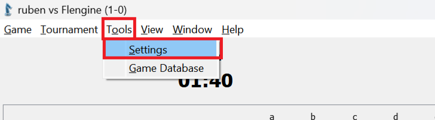

Klickt man dann auf “Settings”, öffnet sich ein weiteres Einstellungsmenü. Hier muss in den Engine-Tab gewechselt werden.

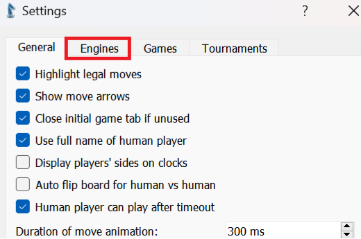

Ist man nun im Engine-Tab, sieht man eine Liste aller hinzugefügten Schach-Engines. Hier muss nun via des Plus-Buttons Flengine hinzugefügt werden.

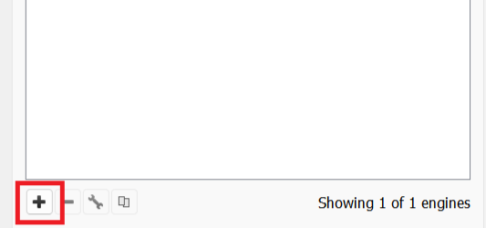

Hat man auf das Plus gedrückt, öffnet sich ein neues Fenster. Als Name kann der gewünschte Anzeigename der Engine angegeben werden. In diesem Fall zum Beispiel “Flengine”.

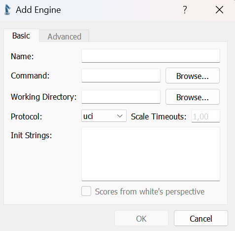

Für “Command” muss der Dateipfad zur BAT-Datei der Flengine angegeben werden. Hier muss dann die Batch-Datei ausgewählt werden, die im zuvor entpackten Ordner liegt.

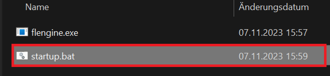

Die Angabe “Working Directory” wird dann automatisch ausgefüllt. Am Ende sieht das Fenster so aus:

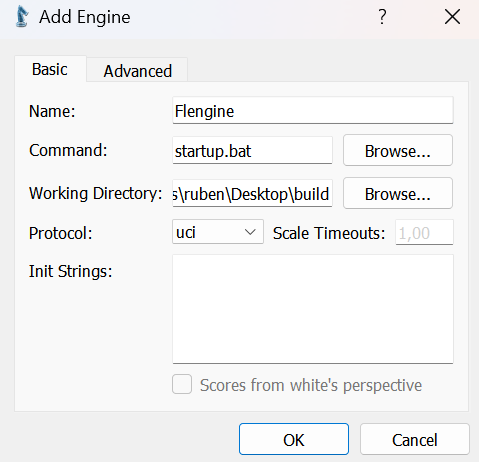

Klickt man nun auf “OK”, ist die Engine im UI hinzugefügt.

# Konfiguration

Wie in [Optionen](../../flengine/querschnittliche-konzeption/optionen.md) beschrieben, unterstützt Flengine das Anpassen über UCI-Options. Um in Cutechess diese Einstellungen vorzunehmen, muss wie im vorherigen Schritt beschrieben, die Engine-Liste geöffnet werden. Dort muss dann “Flengine” ausgewählt und auf das Schraubenschlüssel-Icon am unteren Fensterrand geklickt werden:

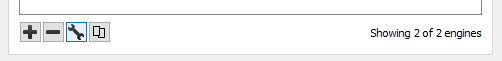

Im daraufhin sich öffnenden Fenster muss in den Tab “Advanced” gewechselt werden.

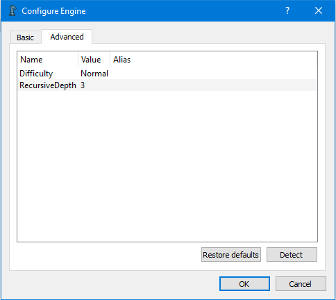

Hier sind alle von der Engine bereitgestellten UCI-Optionen gelistet. Sind keine Optionen gelistet, kann mittels des Buttons “Detect” unten rechts Cutechess dazu aufgefordert werden, die Optionen der Engine zu ermitteln.

Mit einem Doppelklick auf den Wert einer Option, öffnet sich ein Eingabefeld, um den Wert der Option zu ändern.

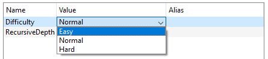

Sind alle Optionen wie gewünscht eingestellt, wird mit einem Klick auf den Button “OK” gespeichert.

# Verwendung

Über New kann ein neues Spiel gestartet werden.

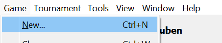

Hier kann dann eingestellt werden welche Variante und wieviel Zeit verfügbar sein soll. Man kann ebenfalls einstellen wer gegeneinander spielen will.

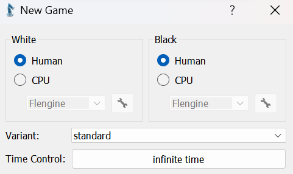

Um nun gegen die Engine zu spielen muss CPU ausgewählt sein und die Flengine ausgewählt werden.

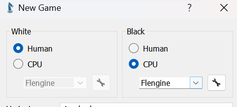

Man kann dadurch ebenfalls durch einstellen von Weiß und Schwarz als CPU gegen andere Engines spielen oder sogar gegen die Engine gegen sich selber antreten lassen.